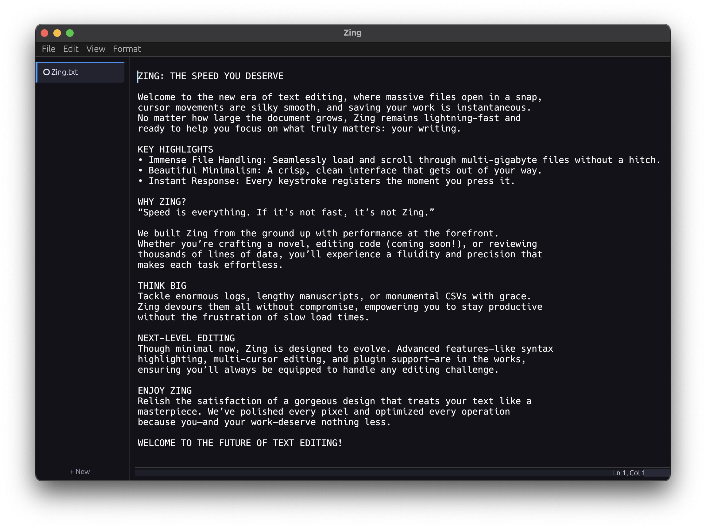

<div align="center">
  
  
  # Zing Text Editor
  
  A fast, beautiful, cross-platform text editor written in Rust
  
  [](https://github.com/sukeesh/zing)
  [](https://www.rust-lang.org/)
  [](http://sukeesh.in/zing/)
  
  [Features](#features) • [Download](#building-from-source) • [Usage](#usage) • [Development](#development)

  
</div>

## ✨ Features

- ⚡ **Fast and Efficient**: Optimized for speed and memory efficiency, capable of handling multi-GB files
- 🎨 **Beautiful UI**: Clean, minimal design with light and dark themes
- 💻 **Cross-Platform**: Runs on Windows, macOS, and Linux
- 📄 **Core Functionality**: Open, Save, and Print text files
- 🔌 **Extensible**: Designed with future extensions in mind

## 🚀 Building from Source

### Prerequisites

- Rust (latest stable version) and Cargo
- A C/C++ compiler (for some dependencies)

### Build Instructions

<details>
<summary><b>Windows</b></summary>

```bash
# Clone the repository
git clone https://github.com/sukeesh/zing.git
cd zing

# Build in release mode
cargo build --release

# Run the application
cargo run --release
```
</details>

<details>
<summary><b>macOS</b></summary>

```bash
# Clone the repository
git clone https://github.com/sukeesh/zing.git
cd zing

# Build in release mode
cargo build --release

# Run the application
cargo run --release
```
</details>

<details>
<summary><b>Linux</b></summary>

```bash
# Install required dependencies (Ubuntu/Debian example)
sudo apt-get update
sudo apt-get install -y libxcb-render0-dev libxcb-shape0-dev libxcb-xfixes0-dev libxkbcommon-dev libssl-dev

# Clone the repository
git clone https://github.com/sukeesh/zing.git
cd zing

# Build in release mode
cargo build --release

# Run the application
cargo run --release
```
</details>

## 📝 Usage

### Opening a File

Click on the "Open" button in the toolbar or use the keyboard shortcut `Ctrl+O` (Windows/Linux) or `Cmd+O` (macOS).

### Saving a File

- **Save**: Click the "Save" button or use `Ctrl+S`/`Cmd+S` to save changes to the current file.
- **Save As**: Use `Ctrl+Shift+S`/`Cmd+Shift+S` to save the current file with a new name or location.

### Printing

Click on the "Print" button or use `Ctrl+P`/`Cmd+P` to print the current document.

## 🛠️ Development

Zing is organized into several modules:

- `buffer`: Text buffer implementation using the Ropey crate
- `ui`: User interface components built with egui
- `file_io`: File input/output operations
- `config`: Configuration and theming

## 👨‍💻 About the Developer

Zing is developed by [Sukeesh](https://github.com/sukeesh). Connect with me:
- GitHub: [@sukeesh](https://github.com/sukeesh)
- LinkedIn: [Sukeesh](https://www.linkedin.com/in/sukeesh/)
- Repository: [github.com/sukeesh/zing](https://github.com/sukeesh/zing)
- Website: [sukeesh.in/zing](http://sukeesh.in/zing/)

## 📜 License

This project is licensed under the MIT License - see the LICENSE file for details.
